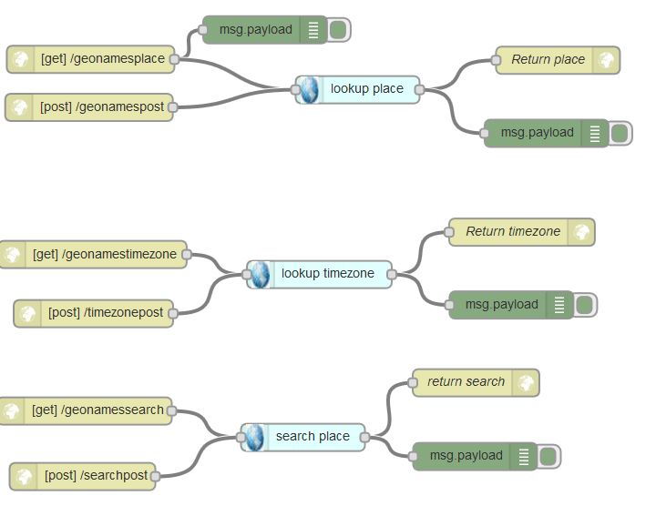
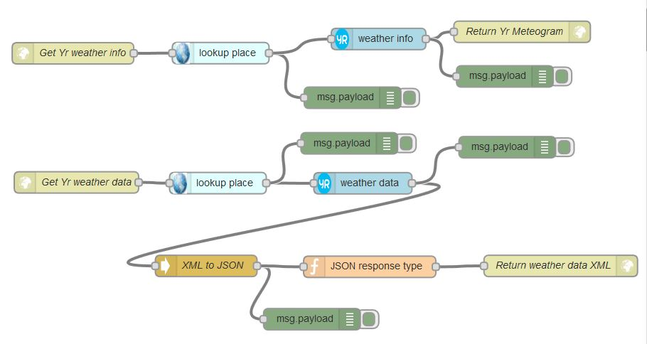

<html><body>
<h3>Node-RED nodes</h3>

This repository contains <a target="_blank" href="http://nodered.org/">Node-RED</a> nodes.

<h3>Geonames</h3>
These nodes use the <a target="_blank" href="http://geonames.org/">geonames.org</a> API.

<h4>lookup-place</h4>
A Node-RED node to perform reverse geolocation place lookup using Geonames.org.

<h4>lookup-timezone</h4>
A Node-RED node to perform timezone lookup using Geonames.org.

<h4>search-place</h4>
A Node-RED node to perform search for geographical places using Geonames.org.

<h3>Yr</h3>
These nodes use the <a target="_blank" href="http://yr.no/">yr.no</a> weather data and links.

<h4>weather-data</h4>
A Node-RED node to lookup Yr.no weather data (in XML format).

<h4>weather-info</h4>
A Node-RED node to lookup Yr.no weather info links.

<h3>Samples</h3>
Node-RED sample flows. The two flows are examples of using the Geonames and / or Yr nodes in Node-RED.

Sample test URL's:

 Geonames reverse geolocation lookup:
<a target="_blank" href="http://noderedjo2.mybluemix.net/geonamesplace?latitude=59.93797728565216&longitude=10.720676915344256&username=demo">http://noderedjo2.mybluemix.net/geonamesplace?latitude=59.93797728565216&longitude=10.720676915344256&username=demo</a>

<strong>Node-RED Geonames sample flow</strong>

Yr weather links:
<a target="_blank" href="http://noderedjo2.mybluemix.net/yrinfo?latitude=59.93797728565216&longitude=10.720676915344256&username=demo">http://noderedjo2.mybluemix.net/yrinfo?latitude=59.93797728565216&longitude=10.720676915344256&username=demo</a>

<strong>Node-RED Yr sample flow</strong>

</body></html>
