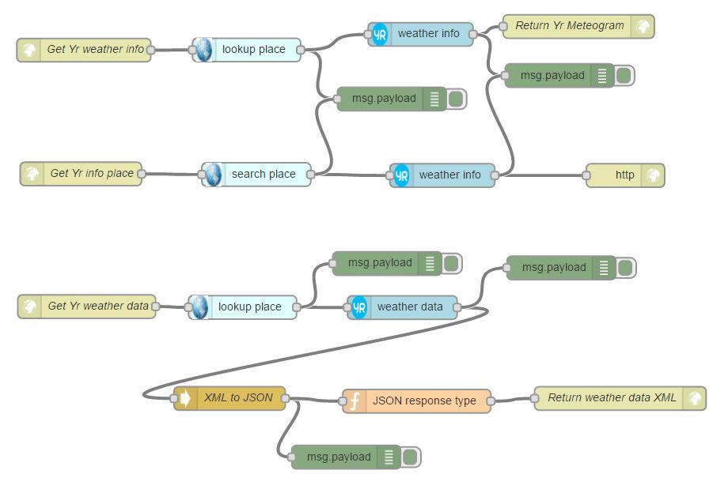

<h3>Samples</h3>

<h4>Yr Google Maps</h4>
This sample adds Yr weather information lookup for a given geolocation. Move the "blue ball" marker by dragging it to a desired
location and release it. Click on the marker to view place name (if available) for the geolocation. If Yr weather information
is available, click the "Meteogram" link to view the Yr weather meteogram. You can click on the meteogram to jump to the Web page
at Yr.no for the place.
 

<a target="_blank" href="https://jo2maps.mybluemix.net/map">http://jo2maps.mybluemix.net</a>

 

The yrmaps sample html is located in the samples directory:
<a href="https://github.com/tverilytt/NODE-Red/tree/master/samples">https://github.com/tverilytt/NODE-Red/tree/master/samples</a>
 

<h3>Node-RED sample flows</h3>
The sample flows are examples of using the Geonames and / or Yr nodes in Node-RED.

Sample test URL's:

<strong>Node-RED Geonames sample flow</strong>

Yr weather links:

<strong>Node-RED Yr sample flow</strong>

<strong>Node-RED Geonames-Yr sample flow</strong>

